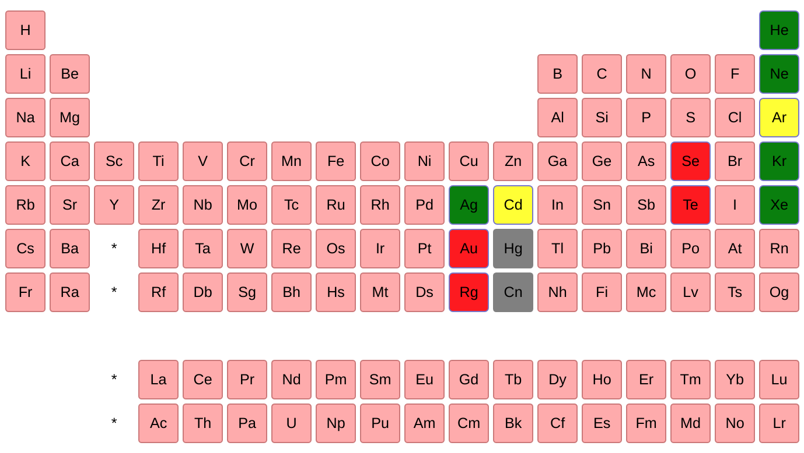

# widget-periodictable

A jupyter widget to select chemical elements from the periodic table.



## Installation

You can install using `pip`:

```bash
pip install widget_periodictable
```

Or if you use jupyterlab:

```bash
pip install widget_periodictable
jupyter lab build
```

If you are using Jupyter Notebook 5.2 or earlier, you may also need to enable
the nbextension:

```bash
jupyter nbextension enable --py [--sys-prefix|--user|--system] widget_periodictable
```
# Acknowlegements

We acknowledge support from:
* EPFL Open Science Fund


